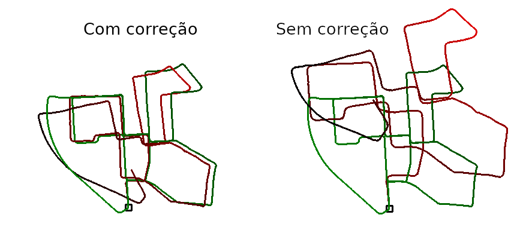

# Projeto de Odometria Visual Monocular
Projeto de Odometria para Drones para o Processo Seletivo do RoboCIn.

# Descrição
Projeto de Odometria Visual Monocular, utilizando apenas uma câmera, com o dataset KITTI.

## Descrição do Algoritmo

1) Capturar nova imagem $I_k$
    - Remover distorção em $I_k$
2) Extrair e encontrar características correspondentes entre $I_{k-1}$ e $I_k$
    - Usar ORB para detectar características em $I_{k-1}$ e FLANN para rastreá-las em $I_k$.
    - Uma nova detecção é ativada se o número de características cair abaixo de um determinado limite.
3) Calcular a Matriz Essencial $E$ para o par de imagens $I_{k-1}$ e $I_k$
    - Usar o algoritmo de 5 pontos de Nister com RANSAC para calcular a matriz essencial.
4) Calcular a Matriz de Rotação $R$ e o Vetor de Translação $t$ a partir de $E$
5) Calcular a escala relativa e redimensionar $t_k$ de acordo
6) Formar $T_k$
7) $C_k = C_{k-1} T_k$
8) Repetir 1)

### Heurísticas:
- A escala é calculada utilizando um algoritmo simples de triangulação..
- Se a escala for muito baixa, é descartada a posição calculada.
- Uma direção preferencial é escolhida, e o vetor de translação é investigado para verificar se essa direção é a predominante.

# Dependências
- O projeto foi implementado em Python 3, com as bibliotecas:
    - OpenCV
    - Numpy
    - Matplotlib
    - Pandas
    - Dataset KITTI
# Uso

1) Instalar as dependências
2) Clonar o repositório
3) Alterar a localização do dataset KITTI no arquivo ./src/config.json
4) Executar o notebook ./src/KITTI.ipynb

# TODO:
1) Ajuste de Escala.
- O problema de cálculo da escala relativa em odometria visual monocular é complexo e exige a utilização de técnicas de visão computacional e geometria projetiva.
- Abaixo a comparação entre um resultado com escala perfeita e com um cálculo simples de escala:

2) Ajuste em pacote. 
- Erros cumulativos afetam o cálculo da próxima posição. Há a necessidade de realizar ajustes (com ajuda de filtros ou machine learning) na posição a cada $m$ iterações.

3) Implementação no dataset EuRoc MAV
- No momento, apenas o uso no dataset KITTI foi implementado. 

4) Implementação com CUDA
- É possível utilizar o CUDA em conjunto com o OpenCV para agilizar os cálculos de odometria.

5) Implementação com C++
- Como a biblioteca OpenCV está disponível em C++, é possível implementar o algoritmo em C++ para melhorar considerávelmente a performance.

# Referências
[1] Davide Scaramuzza and Friedrich Fraundorfer: Visual Odometry: Part I: The First 30 Years and Fundamentals

[2] Davide Scaramuzza and Friedrich Fraundorfer: Visual Odometry Part II: Matching, Robustness, Optimization, and Applications

[3] Avi Singh: Monocular Visual Odometry using OpenCV (https://avisingh599.github.io/vision/monocular-vo/)

[4] Nicolai Nielsen: Visual Odometry with Monocular Camera For Beginners: A Project in OpenCV (https://www.youtube.com/watch?v=N451VeA8XRA)